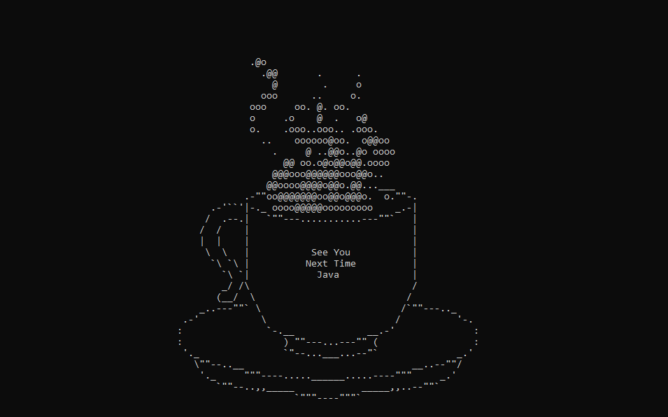

# Coffee Java
This project is a small yet robust Java application designed to showcase my proficiency in Java programming. The primary goal is to implement a simple particle system, demonstrating my ability to work with object-oriented principles and real-time simulations using a terminal text-based renderer. This project not only serves as a skill test but also provides a foundation for further exploration into more complex simulations.

## Key Features:
* **Particle system:** Particles are simulated and managed by a particle system that tracks such states as the position, velocity, and lifespan of a particle. Additionally, the system monitors the density of particles at a given position and reflects that to the rasterizer.
* **ASCII-based Terminal Rendering:** Utilizes ANSI escape codes to visually represent and draw out particles to the terminal. Works on both Unix and Windows based terminals.
* **Double-buffer:** Implements double-buffered system for terminal drawing to minimize flickering and ensure only changed pixels need to be drawn to the terminal.
* **Multi-threading:** Leverages multi-threading for draw buffer management, particle rasterization, and particle physics processing to enhance the performance and responsiveness of the particle system, ensuring smooth real-time updates.

## Tech Stack:
* #### Java 22 SDK
* #### JetBrains IntelliJ (IDE)

## Lessons Learned:
* **Unit Test:** I believe the biggest take-away from this entire project is just to ensure that I do more unit testing for arithmetic based classes such as the Particles. At an earlier part of the project I was fine with just using the basic debugger tool, but after adding in multi-threading, trying to deduce what was wrong with the particles physics through multiple threads was a nightmare.
* **Fixed Delta Time:** Previously working in Unity, I always knew we had to utilize Fixed Delta Time for any physics related code, but I truly never understood why. While working on the multi-threading implementation for the particle physics, I had a sudden revelation; by using a fixed delta time instead of a regular delta time, it ensures that any physics update loops can be called independent of any time-based dependencies which allow for it to be processed with multiple threads.

### Feel free to explore the code, and any feedback or suggestions for improvement are highly appreciate!